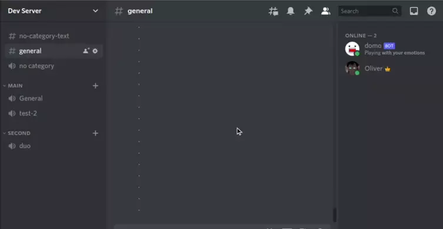

# domo

domo is a Discord bot to help you manage your FOMO (fear of missing out).

It sends a notification when people join a voice channel in your server.
I made this because I found myself frequently checking a server to see if anyone
was there and LFG. Now I can rely on domo to push this info to me instead.

## How it works

The bot is added to a server and listens to
[voice state update](https://discord.com/developers/docs/topics/gateway#update-voice-state)
events. When it encounters an event of someone joining a voice channel it posts
a message to a configured text channel. Once installed in a server, users can
mute the bot or the update channel if they don't want to receive domo updates.



Initially the update messages were a bit spammy so a configurable rate limit
was added. This can be used to prevent someone rapidly joining and leaving a
channel from spamming messages.

## Add to a Server

NOTE: At the moment this is only a private bot. You can self-host using the code
and deployment instructions in this repo.

### Authorize the Bot

Complete the authorization flow by visiting the following link:

* https://discord.com/api/oauth2/authorize?client_id=916474357256171561&permissions=274877910016&scope=bot%20applications.commands

This link identifies the `domo` app id and includes the required permission set:

* Read Messages/View Channels
* Send Messages
* Send Messages in Threads

### Register domo update channel

The domo config (JSON file) must be updated for each server domo is added to.
This is inconvenient but is fine for now since the goal isn't to make this a
public bot. It also saves the hassle of integrating a secondary storage system.

Update `config/bot_main.json` with the server's `GuildID` and a channel ID
where `domo` has permission to post messages. This channel is where `domo`
will publish its update messages. A `rate_limit_sec` value can also be
configured to limit how often `domo` posts.

### Channel Category

To avoid accidentally revealing when people join private voice channels the
bot filters voice events when the voice channel category does not match the
domo update channel category. This means if domo is configured to update a
text channel in the `Main` category it will only report voice channel joins
in the `Main` category. The lack of a category (root) will match other voice
channels in root.

This is a bit of a hack to avoid dealing with comparing the visibility of
the text channel with each voice channel. The proper way to do this would be
to compare identify all roles/users which can see the update channel: `T`.
Then identify all roles/users which can see the voice channel from the event:
`V`. Then verify that `V` is a superset of `T` before posting.

The channel category acts as a reasonable proxy for visibiltiy because you
can configure all channels in a category to have the same visibility.

## Development

Download and install Go: [Instructions](https://go.dev/doc/install)

To run the bot first grab the token from the
[bot page](https://discord.com/developers/applications/916474357256171561/bot).
Then run the bot using the run command below:

```bash
go run cmd/bot/main.go -t ${TOKEN_GOES_HERE}
```

This registers the bot to listen for events in the
[Dev Server](https://discord.com/channels/916746698490015744/916746698490015747).

To run the bot using the main config:

```bash
go run cmd/bot/main.go -t ${TOKEN_GOES_HERE} -c config/bot_main.json
```

NOTE: This may result in duplicate update messages from the bot deployed to
Google Cloud.

## Deployment

Deployment requires two tools be installed:

* `gcloud` is used to authenticate and configure the GCP project
   * [Install Instructions](https://cloud.google.com/sdk/docs/install)
   * Linux: `sudo apt-get install google-cloud-sdk`
* `ko` is used to build a docker container for the bot binary
   * `go install github.com/google/ko@latest`

Once these tools are installed the following script can be run to build and
deploy a new container version:

```bash
./scripts/deploy.sh
```

NOTE: This relies on some manually configured defaults which were set up in
Cloud Console. The most notable are "secrets" which are used to provide the
container the bot config (JSON file) and discord token (env var).

## Initial Discord App setup

Below is a historical account of how this was configured:

1. Visit https://discord.com/developers/applications
1. Create a new application
1. Within the app go to "Bot section and create a bot
1. Disable "Public Bot": this prevents random people adding it to their servers

## Links

* Application Links
  * Discord App: https://discord.com/developers/applications/916474357256171561
  * Cloud Project: https://console.cloud.google.com/home/dashboard?project=domo-334121
* discordgo docs: https://pkg.go.dev/github.com/bwmarrin/discordgo
* Useful Guides
  * [How to run discord bot on cloud run](https://emilwypych.com/2020/10/25/how-to-run-discord-bot-on-cloud-run/)
  * [discord.js introduction](https://discordjs.guide/#before-you-begin)
* Google Cloud docs
  * [Cloud Run Pricing](https://cloud.google.com/run/pricing)
  * [Cloud Run: Build and Deploy Go](https://cloud.google.com/run/docs/quickstarts/build-and-deploy/go)
* Discord API pages
  * [Channel Resource](https://discord.com/developers/docs/resources/channel)
  * [Voice State Object](https://discord.com/developers/docs/resources/voice#voice-state-object)
  * [Permissions](https://discord.com/developers/docs/topics/permissions)
